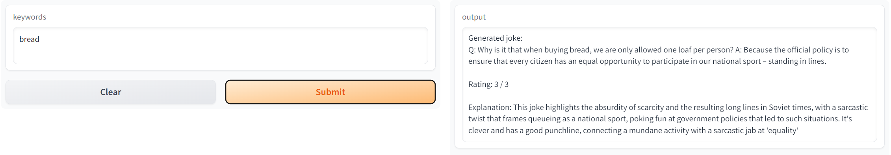
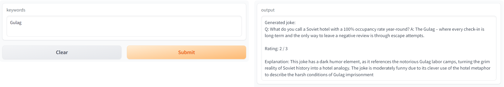
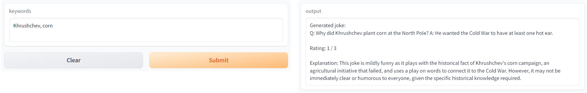
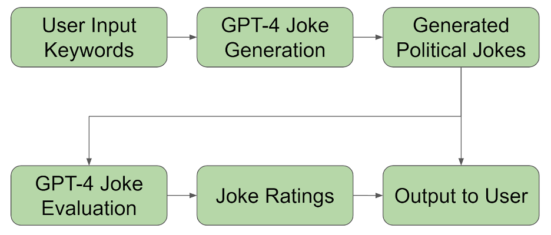

# PoliticalJokes

## Description

Our project PoliticalJokes is a political joke generator based on GPT-4, and it comes with a joke rating system. From a series of keywords from user, it can output a joke based on these words, and a funniness rating for the generated joke. Even with the same set of keywords, it can generate a different joke each run. Our goal is to bring joy and laughter to people.

## Background

There are some previous works that have already explored humor generation and evaluation using GPT. The authors of [1] compared multiple models, including GPT-3, in generating Chinese crosstalk. Mittal et al.[2] and Tian et al.[3] utilized GPT-3 and GPT-2 to generate puns. Witscript 3 [4] leveraged GPT-3 to insert jokes in conversations. However, none of these papers used GPT-4 in joke generation and none of them are related to political jokes, so our project may be the first to explore the potential of GPT-4 in generating political jokes. Regarding joke evaluation, Goes et al. introduced a method to evaluate the funniness of a joke using GPT-3 as 4 AI judges [5], which rated jokes higher than human judges but showed the same trend. Goes et al. continued the study with GPT-4 and they were able to achieve positive correlation between AI score and human score on the funniness of jokes [6]. The evaluation part in this project is different from other works, since we will evaluate if the joke is a political joke, instead of just whether the joke is funny or not.

## User Interface

We have created a web-based user interface based on Gradio. It consists of two parts: user input and model output. Users need to enter the keywords for the joke required by our model in a textbox. Our model will generate a political joke based on these keywords. Subsequently, our model will rate this joke and provide a detailed interpretation and evaluation of the joke.

Examples:

## Architecture

To achieve the purpose of our project, we have divided the operation of the model into two parts: Generator and Evaluator. Both Generator and Evaluator produce results based on GPT-4. The details are shown in the figure:

As shown in the figure, the flow starts with a series of keywords input from users, which will prompt the generator to create a joke based on these words. Then the generated joke will be sent to the evaluator for funiness rating. Finally, both the joke and the rating will be output to users.

## Setup
This is a python based project. Python version 3.8 or higher is mandatory.
* Install the required packages by using the following commands in the terminal(MacOS) or Command Prompt(Windows):
  * `pip install --upgrade gradio pandas tiktoken openai`
    * (You are required to set up an API key to run this project. Please follow Step 2 in https://platform.openai.com/docs/quickstart?context=python.)
* Run the command inside `PoliticalJokes` directory:
  * `python3 main.py`
* The project would be running locally. Use the link for local URL to access the User Interface.

## References

- [1] B. Wang, X. Wu, X. Liu, J. Li, P. Tiwari, and Q. Xie, “Can Language Models Make Fun? A Case Study in Chinese Comical Crosstalk”, 36th Conference on Neural Information Processing Systems Track on Datasets and Benchmarks, 2 Jul 2022.
- [2] A. Mittal, Y. Tian, and N. Peng, “AMBIPUN: Generating Puns with Ambiguous Context”, Vol: Proceedings of the 2022 Conference of the North American Chapter of the Association for Computational Linguistics: Human Language Technologies, Jul 2022.
- [3] AUnifiedFrameworkforPunGenerationwithHumorPrinciples
Y. Tian, D. Sheth, and N. Peng, “A Unified Framework for Pun Generation with Humor Principles”, Vol: Findings of the Association for Computational Linguistics: EMNLP 2022, Dec 2022.
- [4] J. Toplyn, “Witscript 3: A Hybrid AI System for Improvising Jokes in a Conversation”, arXiv:2301.02695, Computation and Language; Artificial Intelligence, 6 Jan 2023. 
- [5] F. Góes, Z. Zhou, P. Sawicki, M. Grzes, and D. G. Brown, “CROWD SCORE: A METHOD FOR THE EVALUATION OF JOKES USING LARGE LANGUAGE MODEL AI VOTERS AS JUDGES”, arXiv:2212.11214, Artificial Intelligence, 21 Dec 2022.
- [6] F. Goes, P. Sawicki, M. Grzes, D. Brown, and M. Volpe, “Is GPT-4 Good Enough to Evaluate Jokes?”, Subject: Q Science > Q Science (General) > Q335 Artificial intelligence, 07 Jun 2023.